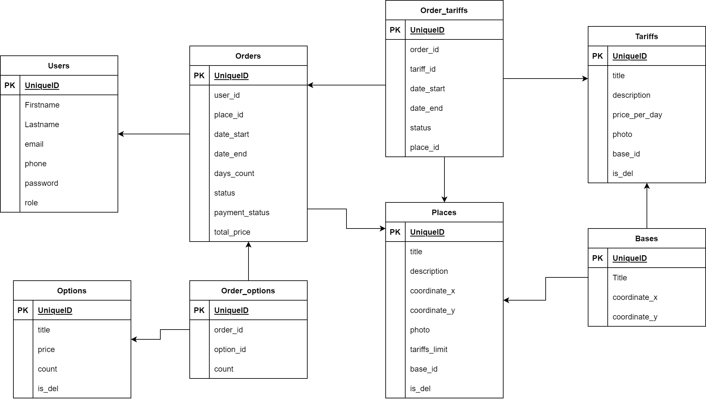

# Таблицы

### Диаграмма


## Пользователи
User
- id
- firstname
- lastname
- email
- phone
- password
- role

## Места
Places
- id
- title
- description
- coordinatex
- coordinatey
- photo (URL фотографий)
- base_id
- tariffs_limit
- is_del

## Тарифы 
Под тарифами подразумевается: дома на колесах, бани на колесах, крутые палатки
Tariffs
- id
- title
- description
- price_per_day
- photo (URL фотографий)
- base_id
- is_del

## Заказы
Orders
- id
- user_Id
- place_Id
- date_start
- date_end
- days_count
- status
- payment_status
- total_price

## Опции
Additonal Options
- id
- title
- price
- count
- is_del

## Order_options
- id
- order_id
- option_id
- count


## Bases
- id
- title
- coordinate_x
- coordinate_y

## Order_tariffs
- id
- order_id
- tariff_id
- place_id
- date_start
- date_end
- status


**Enum Status**:
- Обрабатывается
- В пути
- Доставлено
- Отменено
- Ошибка

**Enum payment status**:
- Оплачено
- Не оплачено

# Эндпоинты 

### Авторизация через:

**Authorization: Bearer {token}**

## Авторизация
### POST sign up
`POST /api/register`

input:
```json
{
	"name":"firstname",
	"surname":"lastname",
	"email":"useremail@mail.ru",
	"phone":"89528125252",
	"password":"password12345",
	"password_confirmation":"password12345"
}
```
output:
```json
{
    "name": "test1",
    "surname": "sdgsgdsd",
    "phone": "12313213213",
    "email": "test1@mail.ru",
    "updated_at": "2024-11-13T20:57:58.000000Z",
    "created_at": "2024-11-13T20:57:58.000000Z",
    "id": 4
}
```


### POST sign in
`POST /api/login`

input:
```json
{
	"email":"username",
	"password":"password12345"
}
```
output:
```json
{
    "token": "9|GXv2xYGxvBMeGBMKv7WBLTrlceObZ73tI3MsXWJN93128b50",
    "name": "Admin",
    "surname": "",
    "phone": "",
    "email": "admin@mail.ru",
    "role": "admin"
}
```

## Пользователь
### GET users info
`GET /api/user`
**auth**

output:
```json
{
    "id": 1,
    "name": "Vladislav",
    "email": "vlad@mail.ru",
    "email_verified_at": null,
    "created_at": "2024-11-11T20:13:31.000000Z",
    "updated_at": "2024-11-11T20:13:31.000000Z",
    "role": "user",
    "surname": "",
    "phone": ""
}
```


### PUT update user details // todo не хочу делать!
`PUT /api/user`
**auth**

input:
```json
{
	"username":"username",
	"firstname":"firstname",
	"lastname":"lastname",
	"email":"useremail@mail.ru",
	"phone":"89528125252"
}
```
output:
```json
{
	"username":"username",
	"firstname":"firstname",
	"lastname":"lastname",
	"email":"useremail@mail.ru",
	"phone":"89528125252"
}
```

## Place
### GET all place previews around
`GET /api/place`
**auth**

Input: 
Query:
- XСoordinate - Double
- YСoordinate - Double
- radius - Double. в километрах (default 50)

Output:
```json
{
	"places":[
		{
			"id":0, 
			"title":"some place 0",
			"description":"some place 0",
			"photo":"photourl",
			"XCoordinate":56.2853,
			"YCoordinate":42.0971
		  },
	  { 
			"id":1, 
			"title":"some place 1",
            "description":"some place 0",
            "photo":"photourl",
			"XCoordinate":36.2853, 
			"YCoordinate":52.0971
		}
	]
}
```

### GET place by id
`GET /api/place/:id`

**auth**

Input:

Path: `id - Long`

Output:
```json
{
	"id":0,
	"title":"some place", 
	"description":"some descriptin", 
	"XCoordinate":52.5252,
	"YCoordinate":34.4333,
	"tariffs":[
		{
			"id":1,
			"title":"дом на колесах",
			"description":"desc",
			"price_per_day":5000.0, 
			"photo":"url1"
		}
	], 
	"tariffs_limit":3,
	"photo":"url1"
}
```

### POST create place
`POST /api/place`

**auth admin**

Input:
```json
{
	"title":"new plave title",
	"description":"new description", 
	"XCoordinate":52.0808,
	"YCoordinate":12.1489,
	"base_id":1,
	"tariff_limit":5,
	"photo":"url1"
}
```

Output:
```json
{
	"id":0,
	"title":"some place", 
	"description":"some descriptin", 
	"XCoordinate":52.5252,
	"YCoordinate":34.4333,
	"tariffs":[
		{
			"id":1,
			"title":"title1",
			"description":"desc",
			"price_per_day":5000.0, 
			"photo":"url" 
		}
	], 
	"tariff_limit":5,
	"photo":"url1"
}
```


### PATCH update place info
`PATCH /api/place/:id`

**auth admin**

Input:

Path: `id - int`

```json
{
	"title":"new plave title",
	"description":"new description", 
	"XCoordinate":52.0808,
	"YCoordinate":12.1489,
	"photos":"url1",
	"base_id":3,
	"tariff_limit":6
}
```

Output:
```json
{
	"id":0,
	"title":"some place", 
	"description":"some descriptin", 
	"XCoordinate":52.5252,
	"YCoordinate":34.4333,
	"tariffs":[
		{
			"id":1,
			"title":"title1",
			"description":"desc",
			"price_per_day":5000.0, 
			"photo":"url" 
		}
	], 
	"tariff_limit":5,
	"photo":"url1"
}
```

### DELETE place
`DELETE /api/place/:id`

**auth admin**

Input: `id - int`

Soft delete

Output: 200 ok

## Orders

### POST create order //done
`POST /api/order`
**auth**

input:
```json
{
	"place_id":1,
	"days_count":5,
	"tarrif_ids":[0],
	"optional_ids":[
		{
            "id":0,
            "count":1
		},
		{
			"id":2,
			"count":4
		}
	],
	"date_start":"2017-03-12T13:37:27+00:00",
	"date_end":"2017-03-12T13:37:27+00:00"
}
```

output:
```json
{
	"id":0,
	"user":{
		"id":0,
		"username":"username0",
		"firstname":"vlad",
		"lastname":"suvorov",
        "email":"mail@mail.ru",
		"phone":"89528120252"
	},
	"place":{
		"id":0,
		"title":"sometitle",
		"XCoordinate":52.2552,
		"YCoordinate":52.5252
	},
	"tariffs":[
		{
			"id":0,
			"title":"title",
			"description":"description",
			"price_per_day":5000.0,
	        "photo":"url",
            "status":"Обрабатывается"
		}
	],
	"days_count":5,
	"status":"Обрабатывается",
	"date_start":"2017-03-12",
	"date_end":"2017-03-17",
	"additional_options":[
		{
			"id":0,
			"title":"opt0",
			"price":200.0,
			"count":1
		},
		{
			"id":2,
			"title":"opt2",
			"price":100.0,
			"count":4
		}
	],
	"total_price":25600.0,
	"payment_status":"Не оплачено",
	"created_at":"2017-03-12T13:37:27+00:00",
	"updated_at":"2017-03-12T13:37:27+00:00"
}
```

### GET order by id
`GET /api/order/:id`

input: id - int,

output:
```json
{
	"id":0,
	"user":{
		"id":0,
		"username":"username0",
		"firstname":"vlad",
		"lastname":"suvorov",
		"phone":"89528120252"
	},
	"place":{
		"id":0,
		"title":"sometitle",
		"description":"description",
		"XCoordinate":52.2552,
		"YCoordinate":52.5252
	},
	"tariff":{
		"id":0,
		"title":"title",
		"description":"description",
		"price_per_day":5000.0,
        "photo": "sdgsgfdg",
        "status":"Обрабатывается"
	},
	"days_count":5,
	"status":"Обрабатывается",
	"date_start":"2017-03-12T13:37:27+00:00",
	"date_end":"2017-03-17T13:37:27+00:00",
	"additional_oprions":[
		{
			"id":0,
			"title":"opt0",
			"price":200.0,
			"count":1
		},
		{
			"id":2,
			"title":"opt2",
			"price":100.0,
			"count":4
		}
	],
	"total_price":25600.0,
	"payment_status":"Не оплачено",
	"created_at":"2017-03-12T13:37:27+00:00",
	"updated_at":"2017-03-12T13:37:27+00:00"
}
```

### GET users by user_id order previews. for Managers
`GET /api/order/user/:id`

**auth admin**

input: username - string

output:
```json
{
	"orders":[
		{
			"id":0,
			"place":{
				"id":0,
				"title":"title"
			},
			"status":"На месте",
			"payment_status":"Оплачено",
			"days_count":5,
			"total_price":25600.0,
			"created_at":"2017-03-12T13:37:27+00:00",
			"updated_at":"2017-03-12T13:37:27+00:00"
		},
		{
			"id":1,
			"place":{
				"id":1,
				"title":"title"
			},
			"status":"В пути",
			"payment_status":"Оплачено",
			"days_count":2,
			"total_price":16300.0,
			"created_at":"2017-03-12T13:37:27+00:00",
			"updated_at":"2017-03-12T13:37:27+00:00"
		}
	]
}
```

### GET all users orders previews. for Managers
`GET /api/order/`

**auth admin**

input: username - string

output:
```json
{
	"orders":[
		{
			"id":0,
			"place":{
				"id":0,
				"title":"title"
			},
			"status":"На месте",
			"payment_status":"Оплачено",
			"days_count":5,
			"total_price":25600.0,
			"created_at":"2017-03-12T13:37:27+00:00",
			"updated_at":"2017-03-12T13:37:27+00:00"
		},
		{
			"id":1,
			"place":{
				"id":1,
				"title":"title"
			},
			"status":"В пути",
			"payment_status":"Оплачено",
			"days_count":2,
			"total_price":16300.0,
			"created_at":"2017-03-12T13:37:27+00:00",
			"updated_at":"2017-03-12T13:37:27+00:00"
		}
	]
}
```

### GET user order previews. for User
`GET /api/order`

input: 

output:
```json
{
	"orders":[
		{
			"id":0,
			"place":{
				"id":0,
				"title":"title"
			},
			"status":"На месте",
			"payment_status":"Оплачено",
			"days_count":5,
			"total_price":25600.0,
			"created_at":"2017-03-12T13:37:27+00:00",
			"updated_at":"2017-03-12T13:37:27+00:00"
		},
		{
			"id":1,
			"place":{
				"id":1,
				"title":"title"
			},
			"status":"В пути",
			"payment_status":"Оплачено",
			"days_count":2,
			"total_price":16300.0,
			"created_at":"2017-03-12T13:37:27+00:00",
			"updated_at":"2017-03-12T13:37:27+00:00"
		}
	]
}
```

### PATCH поменять статус order'а
`PATCH /api/order/:id/process`

**auth admin**
input: id - int

query: 
- status

### PATCH поменять статус тарифа заказа
`PATCH /api/order/:id/tariff/:id/process`

**auth admin**
input: id - int

query:
- status


### PATCH отменить заказ
`PATCH /api/order/:id/cancel`

**auth**

input: id - int


### PATCH мок платёжного шлюза
`PATCH /api/order/:id/pay`

input: id - int


мок для оплаты заказа
меняется payment_status


## Tarrif
### GET all tariffs
`GET /api/tariff`

input: -

output:
```json
{
	"tariffs":[
		{
			"id":0,
			"title":"title0",
			"description":"description0",
			"price_per_day":500.0,
			"photo":"url0",
			"base_id":1
		},
		{
			"id":1,
			"title":"title1",
			"description":"description1",
			"price_per_day":400.0,
			"photo":"url1",
			"base_id":1
		},
		{
			"id":2,
			"title":"title2",
			"description":"description2",
			"price_per_day":50000.0,
			"photo":"url2",
			"base_id":2
		}
	]
}
```

### GET all tariffs by base id
`GET /api/tariff`/base/:id

input: -

output:
```json
{
	"tariffs":[
		{
			"id":0,
			"title":"title0",
			"description":"description0",
			"price_per_day":500.0,
			"photo":"url0",
			"base_id":1
		},
		{
			"id":1,
			"title":"title1",
			"description":"description1",
			"price_per_day":400.0,
			"photo":"url1",
			"base_id":1
		},
		{
			"id":2,
			"title":"title2",
			"description":"description2",
			"price_per_day":50000.0,
			"photo":"url2",
			"base_id":1
		}
	]
}
```
### GET tariff booking info. For Managers
`GET /api/tariff/:id`

input: -

output:
```json
{
	"id":0,
	"title":"title0",
	"description":"description0",
	"price_per_day":500.0,
	"photo":"url0",
	"booking":[
		{
			"date_start":"2017-03-12T13:37:27+00:00",
			"date_end":"2017-03-15T13:37:27+00:00",
			"order_id":1,
			"place_id":1
		},
		{
			"date_start":"2017-03-16T13:37:27+00:00",
			"date_end":"2017-03-17T13:37:27+00:00",
			"order_id":1,
			"place_id":1
		}
	]
	
}
```

### GET tariff booking info. For Users
`GET /api/tariff/:id`

input: -

output:
```json
{
	"id":0,
	"title":"title0",
	"description":"description0",
	"price_per_day":500.0,
	"photo":"url0",
	"booking":[
		{
			"date_start":"2017-03-12",
			"date_end":"2017-03-15"
		},
		{
            "date_start":"2017-03-20",
            "date_end":"2017-03-25"
		}
	]
}
```

### POST create tariff
`POST /api/tariff`

**auth admin**

input:
```json
{
	"title":"title2",
	"description":"description2",
	"price_per_day":50000.0,
	"photo":"url2",
	"base_id":1
}
```

output:
```json
{
	"id":2,
	"title":"title2",
	"description":"description2",
	"price_per_day":50000.0,
	"photo":"url2",
	"base_id":1
}
```

### PATCH update tariff
`PATCH /api/tariff/:id`

**auth admin**

input: id - int

```json
{
	"title":"title2",
	"description":"description2",
	"price_per_day":50000.0,
	"photo":"url2",
	"base_id":1
}
```

output:
```json
{
	"id":2,
	"title":"title2",
	"description":"description2",
	"price_per_day":50000.0,
	"photo":"url2",
	"base_id":1
}
```

### DELETE delete tariff
`DELETE /api/tariff/:id`

**auth admin**

input: id - int

output: ok 200

soft-delete


## Options
### GET all options
`GET /api/option`

input: -

output:
```json
{
	"options":[
		{
			"id":0,
			"title":"title0",
			"price":200.0,
			"count":10
		},
		{
			"id":1,
			"title":"title1",
			"price":100.0,
			"count":10
		},
		{
			"id":2,
			"title":"title2",
			"price":400.0,
			"count":10
		}
	]
}
```

### POST create option
`POST /api/option`
**auth admin**

input:

Query:
- title - string
- price - double


output:
```json
{
	"id":2,
	"title":"title2",
	"price":400.0,
	"count":10
}
```


### PATCH update option
`PATCH /api/option/:id`
**auth admin**

input: id - int

```json
{
	"title":"title",
	"price":200.0,
	"count":10
}
```

output:
```json
{
	"id":2,
	"title":"title2",
	"price":400.0,
	"count":10
}
```

### DELETE option
`DELETE /api/option/:id`

input: id - int
output: ok

soft-delete

